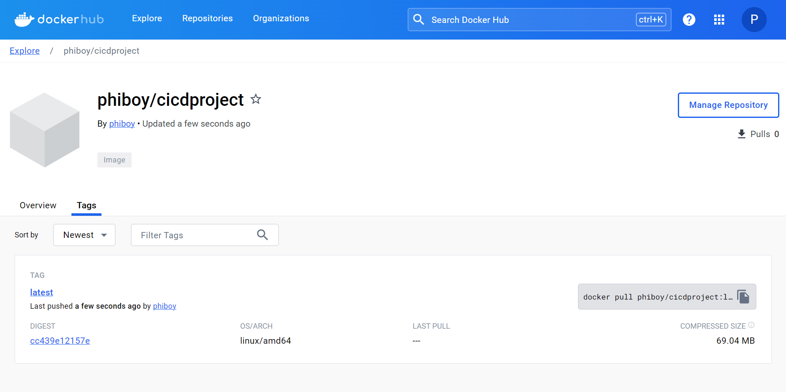
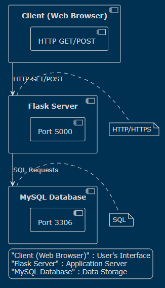

# CI_CD Project

Maxime Avrillon-Thade

# To-Do List Application

Cette application de liste de tâches est un projet web simple qui utilise Flask pour le backend, MySQL pour la base de données et NGINX comme serveur web/proxy inverse. L'application permet aux utilisateurs de créer, mettre à jour et supprimer des tâches.

## Prérequis

Pour exécuter le projet, vous devez avoir installé :

- Docker
- Docker Compose

## Installation et Configuration

1.  **Clonez le dépôt** :

    ```bash
    git clone https://github.com/ErtKid/CI_CD_Project.git
    cd CI_CD_Project
    ```

2.  **Construire et démarrer les conteneurs :** :
    Utilisez Docker Compose pour construire et démarrer les conteneurs :

    ```bash
    docker-compose up --build -d
    ```

3.  **Initialiser la base de données :** :
    Aucune action supplémentaire n'est nécessaire. Lors du premier démarrage, Flask créera les tables nécessaires à l'application.

## Utilisation

Après avoir démarré les conteneurs, vous pouvez accéder à l'application via :

- HTTP : http://localhost (sera redirigé vers HTTPS)
- HTTPS : https://localhost

## Schéma de la Base de Données

    ```bash
    +----------+--------------+------+
    | Colonne  | Type         | Clé  |
    +----------+--------------+------+
    | task_id  | Integer      | PK   |
    | name     | String(100)  |      |
    | done     | Boolean      |      |
    +----------+--------------+------+

    ```

## Images

Push sur Docker Hub :

Architecture du Projet :

